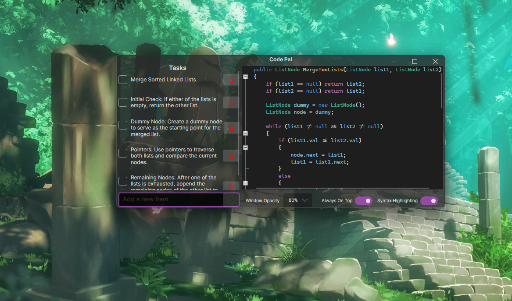

# Code Pal

Code Pal is a utility application written in C# designed to help developers with outlining, task tracking, and pseudocoding. It allows users to create "Task Lists" for to-dos and task tracking, and offers a feature-rich text editor for writing pseudocode. What sets Code Pal apart is its overlay functionality, which displays over any window. This, combined with its translucent and minimal design, enables users to reference their to-dos, notes, tasks, or pseudocode without needing another monitor, ALT-Tabbing, or extra devices.

## Features

- Toggleable Syntax Highlighting
- Toggleable Always On Top propery
- Adjustable Opacity
- Code Editor - Code Folding
- Code Editor - Auto Indentation
- Code Editor - Brace Matching
- Create Task Items
- Delete Task Items
- Mark Task Items Complete
- Responsive Resizable Window
- Cross Compatibility (Windows, macOS, Linux)

### Syntax HighLighting Supported Languages

- C#

### Future Features

- Save/Load Tasks
- Save/Load Code Editor content
- Export Code Editor to user selected file format
- Add Syntax Highlighting for more languages
- Support in-app Syntax Highlighting theme changes/modifications
- (* Implemented *) Toggles for specific features ie. Enable/Disable Brace Matching etc
- (* Implemented *) User determined opacity
- (* Implemented *) Responsive/Resizable form.

## Screenshots

## Changelog

August 6th, 2024 - Code Pal has been updated to use AvaloniaUI instead of WinForms. This update aimed to provide not only cross compatibility, but also a modern UI that allows for the utilization of modern features natively.

## Acknowledgements / Technologies

- AvaloniaUI
- AvaloniaEdit
